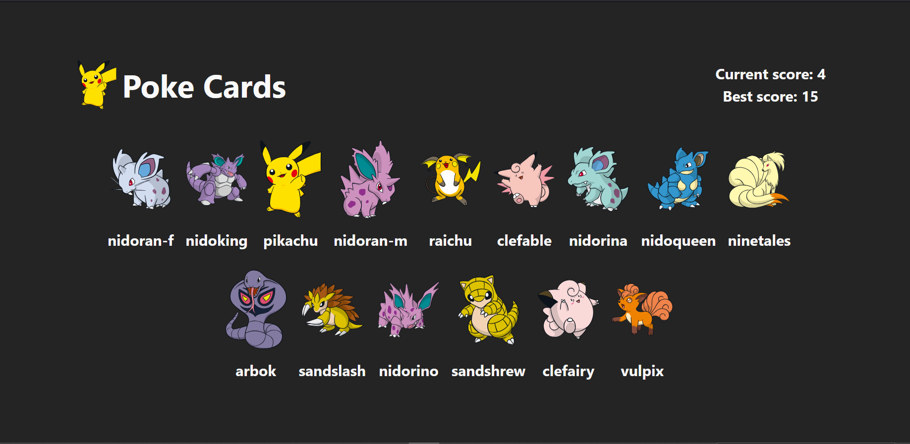

# The odin project - Memory Card

This is a solution to the [Memory card challenge on the odin project](https://www.theodinproject.com/lessons/node-path-react-new-memory-card#project-solution).

## Table of contents

- [Overview](#overview)
  - [The challenge](#the-challenge)
  - [Screenshot](#screenshot)
  - [Links](#links)
- [My process](#my-process)
  - [Built with](#built-with)
  - [What I learned](#what-i-learned)
- [Author](#author)

## Overview

### The challenge

Users should be able to:

- play a memory card game.
- get their current and best score.
- get notified when the win or lose the game.

### Screenshot

### Links

- Solution URL: [solution URL](https://github.com/bashair0/react-memory-card)
- Live Site URL: [live site URL]()

## My process

### Built with

- React library
- Vite bundler
- Cloudflare deployment

### What I learned

The major thing I learned working with this project is how to use useEffect hook in react.

and the second one is how to fetch apis using the useEffect hook in react.

## Author

- Frontend Mentor - [@bashair0](https://www.frontendmentor.io/profile/bashair0)
